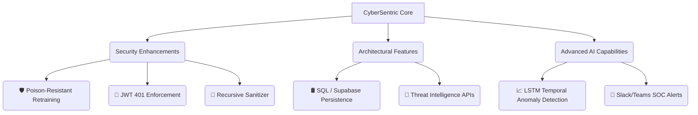

# 🛡️ CyberSentric: Cyber Security Assessment & Feature Roadmap

This document provides a deep-dive security analysis of the **CyberSentric** codebase, detailing the structural, logical, and cryptographic loopholes present in the architecture, followed by an advanced feature roadmap to prepare the system for production-grade deployment.

---

## 🔍 Part 1: Loopholes & Vulnerabilities in CyberSentric

Our analysis of the backend codebase has identified **five major security and architectural loopholes**, ranging from critical authentication bypasses to machine learning data poisoning.

---

### 1. 🧪 Machine Learning Model Poisoning (Adversarial Retraining)
* **Severity**: 🔴 **Critical**
* **Vulnerable Component**: [anomaly_detector.py](file:///c:/Users/ADARSH%20SINGH/OneDrive/Desktop/CyberSentric/backend/app/ml/anomaly_detector.py#L83-L93) and [_retrain()](file:///c:/Users/ADARSH%20SINGH/OneDrive/Desktop/CyberSentric/backend/app/ml/anomaly_detector.py#L184-L205)

#### Technical Explanation
The platform's core machine learning brain, the **Isolation Forest** model, is trained to detect deviations from a "normal" traffic baseline. While the initial baseline is generated synthetically using only clean parameters, the system dynamically retrains itself every 200 requests to adjust for environmental traffic drift:

```python
# From anomaly_detector.py -> predict()
self._feature_history.append(features)  # Unconditionally adds incoming request features
...
if self._samples_since_retrain >= self.RETRAIN_INTERVAL:
    self._retrain()  # Retrains on self._feature_history
```

Because **every** request's feature vector is appended to `self._feature_history` unconditionally (regardless of whether the request is classified as clean, suspicious, or malicious), an attacker can easily execute a **Model Poisoning Attack**. 

#### Exploit Scenario
1. An attacker sends a high-volume burst of malicious inputs (e.g., highly rapid requests, large SQL injection strings with high special-character ratios, or brute-force attempts).
2. The system initially flags these as anomalies.
3. However, these malicious vectors saturate `_feature_history` (which caps at 2,000 samples).
4. When `_retrain()` is triggered, the Isolation Forest trains on a history that contains a significant percentage of malicious traffic.
5. **Result**: The model establishes high request rates, extreme special character ratios, and high entropy as **normal baseline behavior**. The classification thresholds drift upward, rendering subsequent high-severity attacks invisible to the ML engine.

---

### 2. 🔐 Authentication Bypass & Silent Fallback
* **Severity**: 🔴 **Critical**
* **Vulnerable Component**: [auth.py](file:///c:/Users/ADARSH%20SINGH/OneDrive/Desktop/CyberSentric/backend/app/routes/auth.py#L60-L70)

#### Technical Explanation
The token authentication helper `get_current_user` is designed to validate incoming JWT bearer tokens. However, the dependency fails to enforce authorization. If a token is missing, expired, or cryptographic verification fails, the function catches the error and silently falls back to returning a mock anonymous user with `"role": "user"` instead of raising a `401 Unauthorized` exception:

```python
async def get_current_user(creds: Optional[HTTPAuthorizationCredentials] = Depends(security)) -> dict:
    if not creds:
        return {"username": "anonymous", "role": "user"}  # Silent fallback
    try:
        payload = jwt.decode(creds.credentials, settings.SECRET_KEY, ... )
        ...
    except JWTError:
        pass
    return {"username": "anonymous", "role": "user"}  # Invalid token fallback
```

#### Exploit Scenario
Most core API routes in `core.py` (e.g., `/api/dashboard`, `/api/agents`, `/api/threats`, `/api/stats`, `/api/redteam/history`) protect themselves using:
```python
user: dict = Depends(get_current_user)
```
Because of the silent fallback, **any unauthenticated user, or any request with a garbage token**, is successfully validated and granted the `"user"` role. This allows external threat actors to read internal system telemetry, view blocked IP structures, browse threat history logs, and fetch operational system metrics without credentials. 
*(Note: Only the `/api/redteam/simulate` endpoint is secure, as it explicitly asserts an admin role via `require_admin`).*

---

### 3. 🛡️ Sanitization Bypass via Nested HTML Tags
* **Severity**: 🟠 **High**
* **Vulnerable Component**: [defender.py](file:///c:/Users/ADARSH%20SINGH/OneDrive/Desktop/CyberSentric/backend/app/agents/defender.py#L291-L303)

#### Technical Explanation
The Defender Agent utilizes regular expressions in `_sanitize_input` to scrub malicious tags and commands from user input. The sanitization routine is executed sequentially:

```python
# 1. Removes script tags
sanitized = re.sub(r"<script[^>]*>.*?</script>", "[REMOVED]", text, flags=re.IGNORECASE | re.DOTALL)
# 2. Removes HTML tags
sanitized = re.sub(r"<[^>]+>", "", sanitized)
```

Because these replacements are run **only once** instead of recursively, it is prone to **nested tag evasion**.

#### Exploit Scenario
* If an attacker submits a payload like `<img src=x onerror=alert(1)>`:
  1. The first regex does not find a `<script>` block.
  2. The second regex processes the input and matches `<[^>]+>`. It locates the nested `` tag and replaces it with an empty string.
  3. Re-assembling the remaining string constructs ``.
  4. **Result**: Malicious XSS code bypasses sanitization entirely and is sent forward to the application logic.

---

### 4. 🔀 Ephemeral In-Memory State & Loss of Audit Trail
* **Severity**: 🟡 **Medium**
* **Vulnerable Component**: [database.py](file:///c:/Users/ADARSH%20SINGH/OneDrive/Desktop/CyberSentric/backend/app/database.py#L164-L255) and [auth.py](file:///c:/Users/ADARSH%20SINGH/OneDrive/Desktop/CyberSentric/backend/app/routes/auth.py#L27-L32)

#### Technical Explanation
User records are stored in a simple global dictionary `USERS_DB` in `auth.py`. Similarly, threat history, telemetry metrics, and automated blocking decisions are held in an ephemeral `InMemoryStore` inside `database.py` whenever MongoDB is unavailable.

#### Exploit Scenario
* When the server is restarted (due to updates, maintenance, or simple crash loops):
  1. All custom-created administrator accounts and registered security users are wiped out.
  2. The database resets to the hardcoded defaults (`admin` / `admin123` and `user` / `user123`), re-enabling default credentials which are widely known.
  3. The **active blocklist of malicious IPs is completely cleared**, allowing previously blocked attackers to reconnect immediately.
  4. The platform loses its audit trails and historical forensic data, violating compliance standards (e.g., SOC2, ISO 27001).

---

### 5. 🧩 Regex Evasion of Heuristic Rules
* **Severity**: 🟡 **Medium**
* **Vulnerable Component**: [defender.py](file:///c:/Users/ADARSH%20SINGH/OneDrive/Desktop/CyberSentric/backend/app/agents/defender.py#L28-L73)

#### Technical Explanation
The first layer of threat defense is entirely rule-based, searching for static injection patterns (e.g., `"ignore all previous instructions"`, `"DROP TABLE"`, `"OR 1=1"`). 

#### Exploit Scenario
Attackers can easily craft simple variants that bypass the compiled pattern-matching regexes:
* **Obfuscation**: Using string concatenation in SQL queries (e.g., `UN` + `ION SE` + `LECT`) or hexadecimal notation.
* **Jailbreaking**: Using translation prompts (e.g., presenting a prompt injection in Base64 encoding or a foreign language like French/German) which completely bypasses the English regexes but is natively decoded and executed by the downstream LLM.

---

## 🚀 Part 2: Proposed Advanced Features Roadmap

To transition CyberSentric from a stunning prototype into an enterprise-grade cyber defense powerhouse, we recommend implementing the following high-value features.



---

### 1. 🛡️ Poison-Resistant ML Retraining (Sanitized History)
* **Goal**: Solve the Model Poisoning vulnerability.
* **Implementation Details**:
  * Modify `AnomalyDetector.predict()` to only append feature vectors to `self._feature_history` if the request is classified as `normal`.
  * Create a isolated buffer for suspicious request logs so analysts can audit false negatives without contaminating the active training set.
  * Implement an operational alert if the percentage of anomalies spikes significantly in a short period, blocking model updates during a suspected attack run.

---

### 2. 🛢️ SQL Server or Supabase Persistent Storage
* **Goal**: Eliminate in-memory volatility and establish persistent auditing.
* **Implementation Details**:
  * Re-architect `database.py` to hook into a persistent database like PostgreSQL, SQLite, or Supabase.
  * Migrate `USERS_DB` to a `users` table with proper standard relational indexing.
  * Establish tables for `threat_logs`, `action_history`, and `system_metrics`, ensuring blocking decisions survive server restarts.

---

### 3. 📈 Temporal / Sequence Anomaly Detection (LSTM Model)
* **Goal**: Capture multi-step attacks that look safe in isolation.
* **Implementation Details**:
  * Introduce a deep learning Recurrent Neural Network (LSTM or GRU) parallel pipeline.
  * Instead of scoring single requests, evaluate groups of $N$ consecutive request features from the same user/IP.
  * This allows CyberSentric to flag slow-rate brute-force attacks, directory scanning, and low-and-slow DDoS attacks that bypass regular Isolation Forest features.

---

### 4. 📡 Active Threat Intelligence Integration (VirusTotal / AbuseIPDB)
* **Goal**: Validate IP reputation in real-time.
* **Implementation Details**:
  * Integrate third-party security API calls in the Orchestrator stage.
  * When an incoming request arrives, query APIs like AbuseIPDB or VirusTotal to see if the `source_ip` is flagged as a known malicious endpoint.
  * The reputation score is blended into the Analyzer Agent's behavioral weight to dynamically lower threat-detection thresholds for known high-risk sources.

---

### 5. 💬 Instant SOC Notifications (Twilio SMS, Slack, Discord)
* **Goal**: Alert security response teams instantly.
* **Implementation Details**:
  * Build a notification routing engine within `ResponseAgent`.
  * For any threat classified as `CRITICAL` or `HIGH`, trigger webhook calls to a Slack/Discord channel or SMS alert via Twilio, enabling instant response by SOC engineers.

---

### 6. 🔄 Advanced Recursive Sanitizer and LLM Guardrails
* **Goal**: Secure input sanitization and prevent advanced prompt injections.
* **Implementation Details**:
  * Implement recursive replacement loops in `_sanitize_input` so nested tags like `<scr<script>ipt>` are fully stripped.
  * Integrate modern open-source LLM safety checkers (like **Llama Guard** or **Guardrails AI**) to check prompt semantic intentions rather than using simple keyword regexes.
